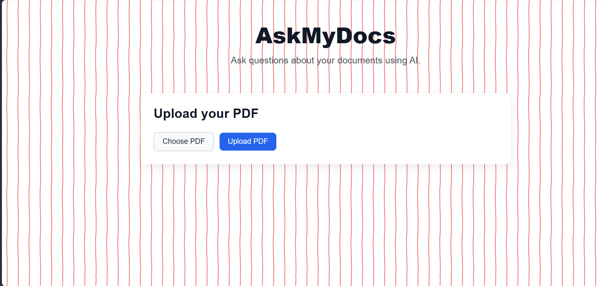
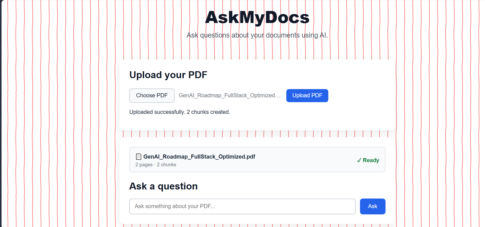
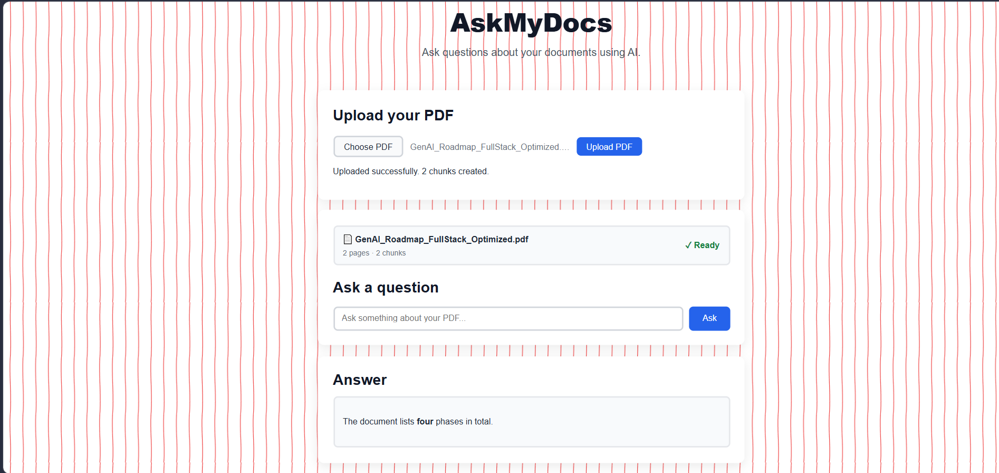

# AskMyDocs

> A full-stack Retrieval-Augmented Generation (RAG) application that allows users to upload PDF documents and ask questions about their content using AI.

🔗 **Live Demo:** https://askmydocs-tan.vercel.app/

---

## 📸 Screenshots-->check out Screenshot folder

### 1. AskMyDocs Home
The landing page where users can upload a PDF document.

---

### 2. Document Uploaded
After uploading a PDF, AskMyDocs processes the document and displays the uploaded file along with its processing status.

---

### 3. Question & AI Answer
Users can ask questions about the uploaded document and receive an AI-generated answer based on the relevant document content.

---

## 🚨 Problem

Finding specific information inside large PDF documents can be time-consuming.

Traditional approaches require users to manually search through pages and understand the surrounding context. Keyword-based search can also fail when the user asks a question using different wording than what appears in the document.

AskMyDocs solves this problem by allowing users to interact with their documents using natural-language questions.

---

## 💡 Solution

AskMyDocs uses a Retrieval-Augmented Generation (RAG) pipeline.

When a PDF is uploaded:

1. The PDF text is extracted.
2. The extracted text is divided into smaller chunks.
3. Each chunk is converted into a vector embedding.
4. The embeddings are stored in Pinecone.
5. When a user asks a question, the question is converted into an embedding.
6. Pinecone performs semantic similarity search to find relevant document chunks.
7. The retrieved context is sent to a Groq-powered LLM.
8. The LLM generates an answer using the retrieved document context.

This allows the application to answer questions based on the uploaded document rather than relying only on the model's general knowledge.

---

## ✨ Features

- 📄 Upload PDF documents
- 🔍 Extract text from PDF files
- ✂️ Automatically split documents into manageable chunks
- 🧠 Generate vector embeddings
- 🔎 Semantic similarity search using Pinecone
- 📚 Document-scoped retrieval
- 🤖 AI-generated answers using Groq
- 📝 Markdown-formatted AI responses
- ⚡ React-based interactive frontend
- 🔗 REST API using Node.js and Express
- ☁️ Fully deployed frontend and backend

---

## 🧠 RAG Architecture

`
                ┌──────────────────┐
                │    React UI      │
                │     Vercel       │
                └────────┬─────────┘
                         │
                         ▼
                ┌──────────────────┐
                │  Express API     │
                │     Render       │
                └────────┬─────────┘
                         │
                  PDF Upload
                         │
                         ▼
                ┌──────────────────┐
                │  PDF Text        │
                │  Extraction      │
                └────────┬─────────┘
                         │
                         ▼
                ┌──────────────────┐
                │    Chunking      │
                └────────┬─────────┘
                         │
                         ▼
                ┌──────────────────┐
                │    Embeddings    │
                │ Pinecone         │
                │ Inference        │
                └────────┬─────────┘
                         │
                         ▼
                ┌──────────────────┐
                │    Pinecone      │
                │  Vector Search   │
                └────────┬─────────┘
                         │
                  Relevant Chunks
                         │
                         ▼
                ┌──────────────────┐
                │   Groq LLM       │
                │ Answer Generation│
                └────────┬─────────┘
                         │
                         ▼
                ┌──────────────────┐
                │   AI Answer      │
                │    React UI      │
                └──────────────────┘
🛠️ Tech Stack
Frontend
React
Vite
JavaScript
React Markdown
CSS
Backend
Node.js
Express.js
Multer
unpdf
REST APIs
AI / RAG
Retrieval-Augmented Generation (RAG)
Pinecone
Pinecone Inference
llama-text-embed-v2
Groq
openai/gpt-oss-20b
Semantic Vector Search
Deployment
Vercel — Frontend
Render — Backend
Pinecone — Vector Database
Groq — LLM API

🔄 Application Flow
Document Processing
PDF Upload
    ↓
Multer
    ↓
PDF Text Extraction
    ↓
Recursive Text Chunking
    ↓
Pinecone Embeddings
    ↓
Store Vectors + Metadata
Question Answering
User Question
    ↓
Question Embedding
    ↓
Pinecone Similarity Search
    ↓
Top Relevant Chunks
    ↓
Context + Question
    ↓
Groq LLM
    ↓
Generated Answer

🔐 Document Isolation
Each uploaded document receives a unique documentId.The document ID is stored as metadata with every vector:
documentId
text
embedding

When a question is asked, Pinecone filters the search using the corresponding documentId.

This prevents retrieval from unrelated documents.

📂 Project Structure
AskMyDocs/
│
├── client/
│   ├── src/
│   │   ├── components/
│   │   │   ├── UploadBox.jsx
│   │   │   ├── QuestionBox.jsx
│   │   │   ├── AnswerBox.jsx
│   │   │   └── SourceList.jsx
│   │   │
│   │   ├── services/
│   │   │   └── api.js
│   │   │
│   │   ├── App.jsx
│   │   ├── main.jsx
│   │   └── index.css
│   │
│   ├── package.json
│   └── .env
│
├── server/
│   ├── services/
│   │   ├── pdfService.js
│   │   ├── vectorService.js
│   │   └── llmService.js
│   │
│   ├── uploads/
│   ├── index.js
│   ├── package.json
│   └── .env
│
├── screenshots/
│   ├── home.png
│   ├── uploaded-document.png
│   └── question-answer.png
│
└── README.md

🌐 Live Deployment
Frontend Deployed using Vercel.
🔗 Live Application:
https://askmydocs-tan.vercel.app/

Backend
The Express API is deployed separately using Render.

The frontend communicates with the deployed backend through the VITE_API_URL environment variable.
